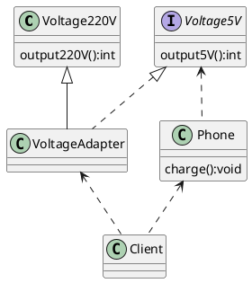

# 类适配器模式

```plantuml
@startuml
class Voltage220V {
    output220V():int
}

interface Voltage5V {
    output5V():int
}
class Phone {
    charge():void
}
Voltage220V <|-- VoltageAdapter
Voltage5V <|.. VoltageAdapter 

Voltage5V <.. Phone

Phone <..Client
VoltageAdapter <..Client

@enduml
```

缺点

* 需要做继承，有局限性
* src类的方法在Adapter中都会暴露出来，增加使用成本

优点

* 可以根据需要重写src类的方法，使用Adapter灵活性增强
