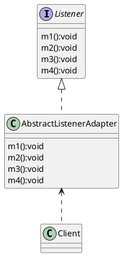

# 接口适配器模式

* 也称适配器模式或缺省适配器模式
* 当不需要全部实现接口提供的方法时，可先设计一个抽象类实现接口，并为该接口中**所有方法**提供一个默认实现（空方法），该抽象类的子类可有选择地覆盖父类的某些方法来实现需求
* 适用于不想使用接口中某些方法的情况

```plantuml
@startuml
interface Listener {
    m1():void
    m2():void
    m3():void
    m4():void

}
class AbstractListenerAdapter {
    m1():void
    m2():void
    m3():void
    m4():void
}
Listener <|.. AbstractListenerAdapter
AbstractListenerAdapter <.. Client 
@enduml
```
