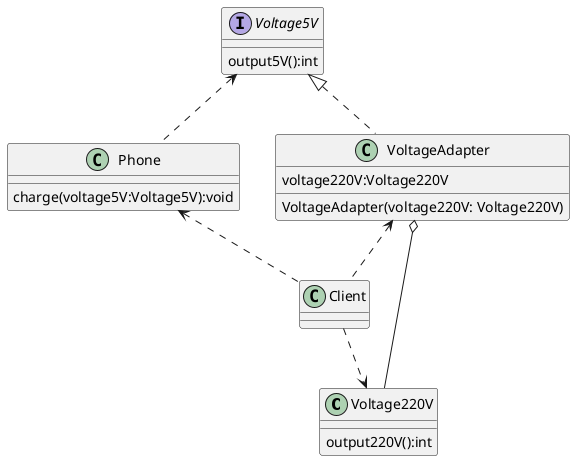

# 对象适配器模式

1. Adapter不继承src类，而是持用src类的实例。通过聚合src类，实现dst类接口完成src->dst的适配
2. 根据合成利用原则，在系统中尽量使用关联关系来替代继承关系
3. 对象适配器模式是适配器模式常用的一种

```plantuml
@startuml
class Voltage220V {
    output220V():int
}

interface Voltage5V {
    output5V():int
}
class Phone {
    charge(voltage5V:Voltage5V):void
}
class VoltageAdapter {
    voltage220V:Voltage220V
    VoltageAdapter(voltage220V: Voltage220V) 
}

Voltage5V <|.. VoltageAdapter 

Voltage5V <.. Phone

Client ..> Voltage220V
Phone <.. Client
VoltageAdapter <.. Client
VoltageAdapter o-- Voltage220V
@enduml
```
