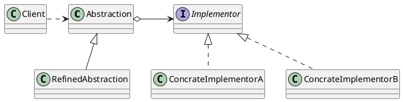

# 桥接模式

1. 将实现与抽象放在两个不同的类层次中，使两个层次可以独立改变
2. 是一种结构型设计模式
3. 基于类的最小设计原则，使用封闭、聚合及继承等行为让不同的类承担不同的职责。主要特点是把抽象与行为实现分离，从而可以保持各部分的独立性及功能扩展

```plantuml
@startuml
class Abstraction{}
interface Implementor{}
Client ..R> Abstraction
Abstraction o--R> Implementor
Abstraction <|-- RefinedAbstraction
Implementor <|.. ConcrateImplementorA
Implementor <|.. ConcrateImplementorB

@enduml
```
