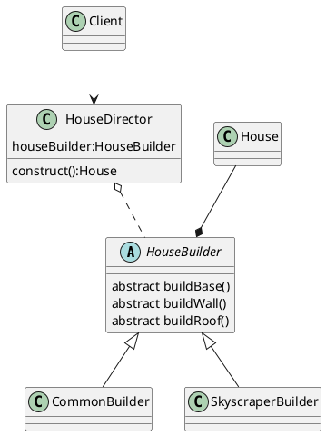

# 例

```plantuml
@startuml
abstract class HouseBuilder {
    abstract buildBase()
    abstract buildWall()
    abstract buildRoof()
}
class HouseDirector{
    houseBuilder:HouseBuilder
    construct():House
}
House --* HouseBuilder
HouseBuilder <|-- CommonBuilder
HouseBuilder <|-- SkyscraperBuilder
HouseDirector o.. HouseBuilder
Client ..> HouseDirector
@enduml
```
