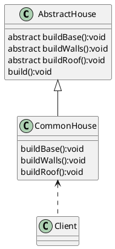

# 不好的实现

```plantuml
@startuml
class AbstractHouse{
    abstract buildBase():void
    abstract buildWalls():void
    abstract buildRoof():void
    build():void
}
class CommonHouse {
    buildBase():void
    buildWalls():void
    buildRoof():void 
}
AbstractHouse <|-- CommonHouse
CommonHouse <.. Client
@enduml
```

* 过于简单，没有缓冲层对象，不易扩展和维护
* 产品和创建和产品的过程封装在一起，耦合性太强
* 要使用建造者模式，将**产品**和**产品建造过程**进行解耦合
