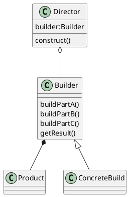

# 建造者模式

1. 又名生成器模式，是一种对象构建模式。可以将复杂对象的建造过程抽象出来，使用抽象过程的不同实现方法构造出不同表现的对象。
2. 建造者模式是一步一步创建一个复杂的对象，允许用户只通过指定复杂对象的类型和内容就可以构建它们，用户不需要知道内部的具体构建细节。

## 四个角色

Product：一个具体的产品对象
Builder：创建一个Product对象的各个部件指定的接口/抽象类
ConcreateBuilder：实现接口，构建和装配各个部件
Director：构建一个使用Builder接口的对象。它主要用于创建一个复杂的对象。它主要有两个作用：

1. 隔离了客户与对象的生产过程
2. 负责控制产品对象的生产过程

## JDK中使用

StringBuilder
