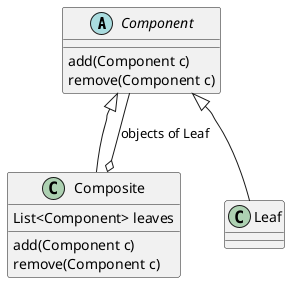

# 组合模式

又称**部分整体模式**。创建对象组的树形结构，以表示整体部分的层次关系。属于结构型模式。
组合模式可以使用户通过一致的方式处理单个对象和组合对象。

适用场景：对象是树形结构，且具有统一的操作方式
JDK源码：HashMap

优缺点：

* 简化客户端操作。只需要面对一致的对象，不用考虑是整体还是叶子的问题。
* 较强扩展性。更改组合对象时只需要调整内部层次关系。
* 适合创建或遍历复杂的层次结构。
* 要求较高的抽象性。中间节点和叶子差异性很大的话，不适合用组合模式。
