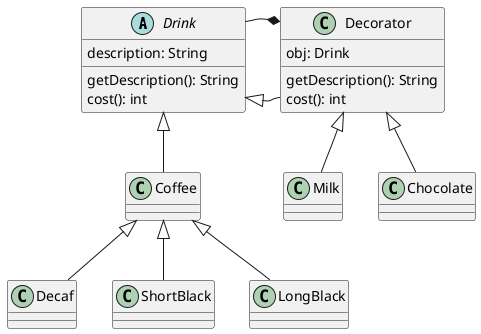
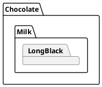

# 装饰器

```plantuml
@startuml
abstract class Drink {
    description: String
    getDescription(): String
    cost(): int
}
class Decorator {
    obj: Drink
    getDescription(): String
    cost(): int
}
Drink <|-- Coffee
Drink <|- Decorator
Drink -* Decorator

Coffee <|-- Decaf
Coffee <|-- ShortBlack
Coffee <|-- LongBlack

Decorator<|--Milk
Decorator<|--Chocolate

@enduml
```

* Drink是被装饰类。Decorator是装饰类，内含有一个被装饰对象
* Decorator的cost()进行费用叠加计算，递归计算价格。比如：LongBlank加了一份牛奶和两份巧克力

```plantuml
@startuml
package Chocolate  {
    package Chocolate  {
        package Milk  {
            package LongBlack
        }
    }
}
@enduml
```
