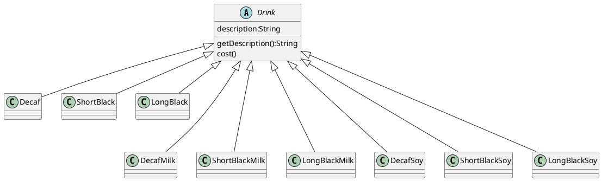
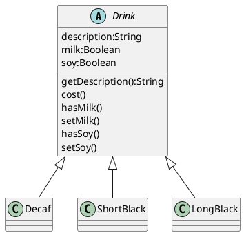

# 不好的实现

咖啡有三种：

* Decaf
* ShortBlack
* LongBlack

配料有两种：

* Milk
* Soy

**NG方案1**
每一组合分别成为一个新的类
问题:当新增加一种咖啡或配料时，两种组合会类爆炸

```plantuml
@startuml
abstract class Drink{
    description:String
    getDescription():String
    cost()
}
Drink <|-- Decaf 
Drink <|-- ShortBlack 
Drink <|-- LongBlack
Drink <|--- DecafMilk
Drink <|--- ShortBlackMilk 
Drink <|--- LongBlackMilk
Drink <|--- DecafSoy
Drink <|--- ShortBlackSoy
Drink <|--- LongBlackSoy
@enduml
```

**NG方案2**
将配料内置到Drink里
问题:增减配料种类时代码维护量大

```plantuml
@startuml
abstract class Drink{
    description:String
    milk:Boolean
    soy:Boolean
    getDescription():String
    cost()
    hasMilk()
    setMilk()
    hasSoy()
    setSoy()
}
Drink <|-- Decaf 
Drink <|-- ShortBlack 
Drink <|-- LongBlack

@enduml
```
