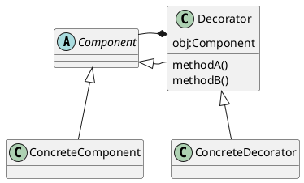

# 装饰器模式

动态地将新功能**附加**到对象上。比继承更有弹性，体现了开闭原则

```plantuml
@startuml
abstract class Component 
class Decorator {
    obj:Component
    methodA()
    methodB()
}
Component <|-- ConcreteComponent
Component <|- Decorator
Decorator <|-- ConcreteDecorator
Decorator *-- Component
@enduml
```

JDK中的使用：FilterInputStream
