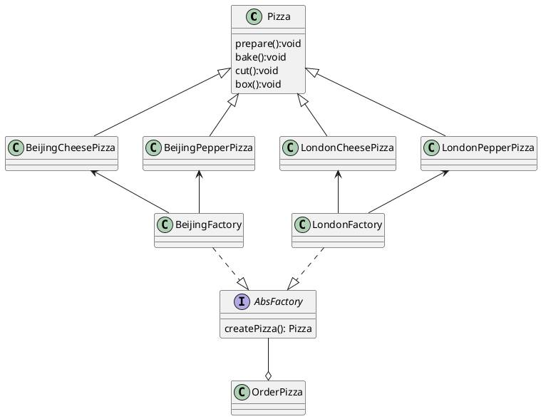

# 抽象工厂模式

* 定义了一个interface用于创建相关或有依赖关系的对象簇，而无需指明具体的类。
* 将简单工厂模式和工厂方法械进行整合。
* 从设计层面上看，抽象工厂模式就是对得意工厂模式的改进。
* 将工厂抽象成两层，抽象工厂和具体实现工厂子类。程序员可以根据创建对象类型使用对应的工厂子类，这样将单个的简单工厂类变成了工厂簇，更利于代码的维护和扩展。

```plantuml
@startuml
class Pizza {
    prepare():void
    bake():void
    cut():void
    box():void
}

Pizza <|-- BeijingCheesePizza
Pizza <|-- BeijingPepperPizza
Pizza <|-- LondonCheesePizza
Pizza <|-- LondonPepperPizza

interface AbsFactory {
    createPizza(): Pizza
}

BeijingFactory ..|> AbsFactory 
LondonFactory..|> AbsFactory
AbsFactory --o OrderPizza

BeijingCheesePizza <-- BeijingFactory
BeijingPepperPizza <-- BeijingFactory
LondonCheesePizza <-- LondonFactory
LondonPepperPizza <-- LondonFactory


@enduml
```
