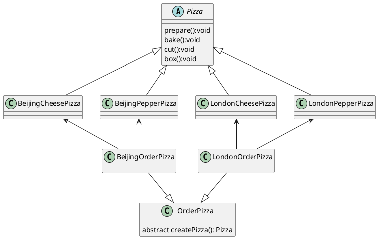

# 工厂方法模式

定义一个创建对象的抽象方法，在不同的子类中具体实现。工厂方法模式将对象的实例化推迟到了子类。

```plantuml
@startuml
abstract class Pizza {
    prepare():void
    bake():void
    cut():void
    box():void
}

Pizza <|-- BeijingCheesePizza
Pizza <|-- BeijingPepperPizza
Pizza <|-- LondonCheesePizza
Pizza <|-- LondonPepperPizza

class OrderPizza {
    abstract createPizza(): Pizza
}
BeijingCheesePizza <-- BeijingOrderPizza
BeijingPepperPizza <-- BeijingOrderPizza
LondonCheesePizza <-- LondonOrderPizza
LondonPepperPizza <-- LondonOrderPizza

BeijingOrderPizza --|> OrderPizza
LondonOrderPizza --|> OrderPizza

@enduml
```
