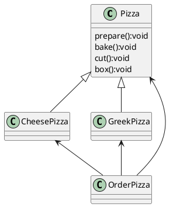

# 不好的实现

```plantuml
@startuml
class Pizza {
    prepare():void
    bake():void
    cut():void
    box():void
}

Pizza <|-- CheesePizza
Pizza <|-- GreekPizza
Pizza <-- OrderPizza
CheesePizza <-- OrderPizza
GreekPizza <-- OrderPizza

@enduml
```

优缺点：

1. 简单易操作
2. 违反了OCP原则。无法做到对扩展开放，对修改关闭。比如新加一种`PepperPizza`时，要加一个`PepperPizza`类并且要改动`OrderPizza`类
