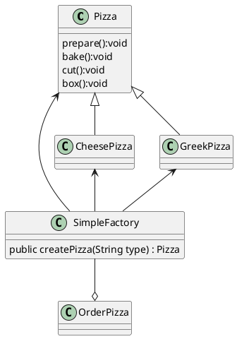

# 简单工厂模式

定义了一个创建对象的类，由这个类来封装实例化对象的行为。

```plantuml
@startuml
class Pizza {
    prepare():void
    bake():void
    cut():void
    box():void
}

class SimpleFactory {
    public createPizza(String type) : Pizza
}

Pizza <|-- CheesePizza
Pizza <|-- GreekPizza
Pizza <-- SimpleFactory
SimpleFactory --o OrderPizza
CheesePizza <-- SimpleFactory
GreekPizza <-- SimpleFactory


@enduml
```

补充：
`public createPizza(String type) : Pizza`也可改成`static`方法，使用时不需要在`OrderPizza`里实例化。
