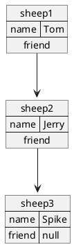
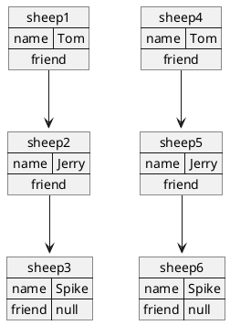

# 深拷贝

1. [利用clone()方法](./clone/)
2. **[利用序列化](./serialzed/)**

before

```plantuml
@startuml
map sheep3 {
    name=>Spike
    friend=>null
}
map sheep2 {
    name=>Jerry
    friend*-->sheep3
}
map sheep1{
    name=>Tom
    friend*-->sheep2
}
@enduml
```

after

```plantuml
@startuml
map sheep3 {
    name=>Spike
    friend=>null
}
map sheep2 {
    name=>Jerry
    friend*-->sheep3
}
map sheep1{
    name=>Tom
    friend*-->sheep2
}
map sheep6 {
    name=>Spike
    friend=>null
}
map sheep5 {
    name=>Jerry
    friend*-->sheep6
}
map sheep4{
    name=>Tom
    friend*-->sheep5
}
@enduml
```
