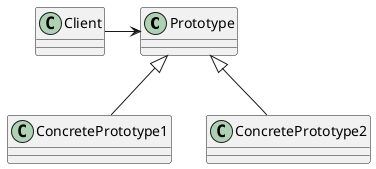

# 原型模式

基本介绍

用原型实例指定创建对象的种类，并且通过拷贝这些原型，创建新的对象
允许一个对象再创建另外一个可定制的对象，无需知道创建的细节

0. [不好的实现](./ng/)
1. [Cloneable](./cloneable/)
2. [浅拷贝](./shallowclone/)
3. [深拷贝](./deepclone/)

* Prototype:原型类，声明一个克隆自己的接口
* ConcretePrototype: 具体的原型类，实现一个克隆自己的操作
* Client:让一个原型对象克隆自己，从而创建一个属性相同的对象

优缺点

1. 创建新的对象比较麻烦时，可以用原型模式简化对象的创建过程，同时提高效率
2. 不用重新初始化对象，而是动态地获得对象运行时的状态
3. 如果原始对象发生变化（增加或减少属性），不影响克隆的执行
4. 深拷贝时可能需要对成员做特殊处理
