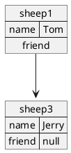
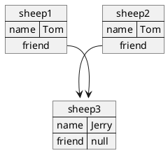

# 浅拷贝

* 基本数据类型的成员变量，直接把值复制过去。
* 引用类型的成员变量，只会进行引用传递，克隆后两个对象的成员变量会指向同一个实例。一个对象修改成员变量后，另一个对象的成员变量也会变化。

before

```plantuml
@startuml
map sheep3 {
    name=>Jerry
    friend=>null
}
map sheep1{
    name=>Tom
    friend*-->sheep3
}
@enduml
```

after

```plantuml
@startuml
map sheep3 {
    name=>Jerry
    friend=>null

}
map sheep1{
    name=>Tom
    friend*-->sheep3
}
map sheep2{
    name=>Tom
    friend*-->sheep3
}
@enduml
```
