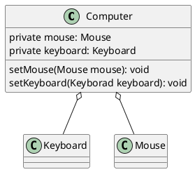

# 聚合

整体和部分可以分开，关联关系的特例。同样具有导航性和多重性。

```plantuml
@startuml
class Computer {
    private mouse: Mouse
    private keyboard: Keyboard
     setMouse(Mouse mouse): void
    setKeyboard(Keyborad keyboard): void
}
Computer o-- Keyboard
Computer o-- Mouse
@enduml
```
