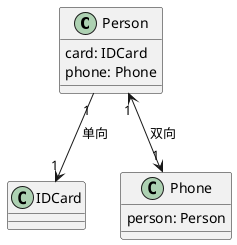

# 关联关系

类与类的联系，是依赖关系的特例
有导航性：

* 双向
* 单向

有多重性：

* "1"：有且只有一个
* "0..."：0个或多个
* "0, 1"：0个或1个
* "n...m"：n到m个
* "m...*"：至少m个

```plantuml
@startuml

class Person {
    card: IDCard
    phone: Phone
}
class IDCard {}
class Phone {
    person: Person
}
Person "1" --> "1" IDCard : 单向
Person "1" <--> "1" Phone : 双向

@enduml
```
