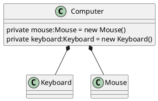

# 组合

整体和部分不可以分开，有包含、拥有的含义。关联关系的特例。
如果实体中存在级联删除，那么也是组合关系。

```plantuml
@startuml
class Computer {
    private mouse:Mouse = new Mouse()
    private keyboard:Keyboard = new Keyboard()
}
Computer *-- Keyboard
Computer *-- Mouse
@enduml
```
