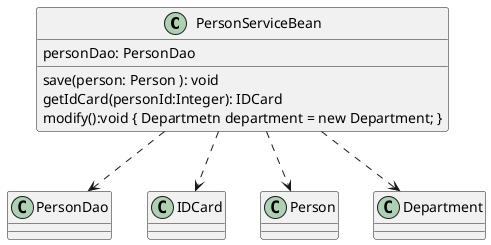

# 依赖关系

只要一个类用到了另一个类，那么它们间就存在依赖关系。
如果没有对方，编译都过不了

四种情况：

1. 在方法中使用到(`Department`)
2. 作为成员属性(`PersonDao`)
3. 作为方法的返回类型(`IDCard`)
4. 作为方法的参数(`Person`)

```plantuml
@startuml
class PersonServiceBean {
    personDao: PersonDao
    save(person: Person ): void
    getIdCard(personId:Integer): IDCard
    modify():void { Departmetn department = new Department; }
}
PersonServiceBean ..> PersonDao
PersonServiceBean ..> IDCard
PersonServiceBean ..> Person
PersonServiceBean ..> Department

@enduml
```
