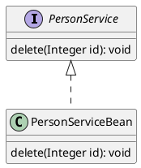

# 实现关系

即接口实现，是依赖关系的特例

```plantuml
@startuml
interface PersonService{
    delete(Integer id): void
}
class PersonServiceBean{
    delete(Integer id): void
}
PersonService<|..PersonServiceBean
@enduml
```
